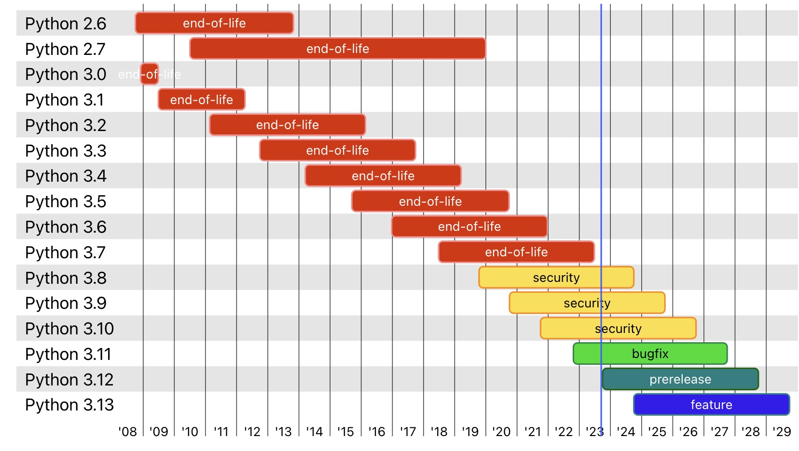

# Data_Science_Python


Datetime:

- Revised: 17-Sep-2023
- Started: 25-April-2018

Python is a great general-purpose programming language on its own, but with the help of a few popular libraries (numpy, scipy, matplotlib, tensorflow, pytorch) it becomes a powerful environment for scientific computing and data analysis.

I started the notebook repo as a beginner tutorial in 2018, then I updated it with more and more interesting topics around the python programming and applications.

## Introduction to Python

Python is a high-level, dynamically typed multi-paradigm programming language. Python code is often said to be almost like pseudocode, since it allows you to express very powerful ideas in very few lines of code while being very readable.
Here is the formal web of Python: [https://www.python.org], you can find a lot of useful learning materials here.

## Python Versions

Check this [https://devguide.python.org/versions/](https://devguide.python.org/versions/) for your new project to choose the right python version.



As you can see, today (2023-09-17),when I update this repo, the latest version of Python is 3.13, and the stable version is 3.10. The Python 2.x and python <3.7 are all end of life.

Python 3.8 is close to its end of life, so I would not recommend to use it for the new project.

Python 3.9, 3.10 are suggested for the new project:

- Please think about the compatibility of the packages you are going to use in your project, some packages may not support the latest version of Python.
- Consider the development and maintenance cost of the project, the latest version of Python may have some bugs, and the packages may not be stable enough.
- Python 3.11, 3.12, 3.13 are not recommended for the new project, because they are still in the development stage, and many packages are not compatible with them.

For this repo, I will use Python 3.11 to refresh the notebooks.  Python 3.11 is between 10-60% faster than Python 3.10.  I am only use this repo for learning purpose, so I am totally Ok with the risk and bugs.

More over, the Anaconda is using python 3.11 as the Installer default version, so I will use it for this repo.

## Install Conda

### Anaconda

The reason why we use Anaconda instead of the original Python is because that the open source Anaconda Distribution is the easiest way to do Python data science and machine learning.
It includes hundreds of popular data science packages, the conda package and virtual environment manager for Windows, Linux and MacOS. Conda makes it quick and easy to install, run and upgrade complex data science and machine learning environments like scikit-learn, TensorFlow and SciPy. Anaconda Distribution is the foundation of millions of data science projects as well as Amazon Web Services' Machine Learning AMIs and Anaconda for Microsoft on Azure and Windows.

- Step 1: Download Anaconda Distribution Python version for Windows, MacOS or Linux from the official website: [Download Link](https://www.anaconda.com/download/).
- Step 2: Install Anaconda with the default settings, unless you know what you are doing.
- Step 3: Open Anaconda Navigator, you can use GUI to manage your environments and packages.

### Miniconda (Recommended)

If you think Anaconda is too big to install, you can try the Miniconda, which is a smaller version of Anaconda. It includes only conda, Python, the packages they depend on, and a small number of other useful packages, including pip, zlib and a few others. Use the conda install command to install 720+ additional conda packages from the Anaconda repository.

This is the link to download Miniconda: [Download Link](https://docs.conda.io/en/latest/miniconda.html).

## Basic conda commands

One good feature about `conda` is its virtual environment manager, it avoids the confusion of different version python interpreters mess your computer default or previous projects.

In the follow section, we will learn the basic operations about using environments.
There are two ways to start the Conda Command Line Window:

- 1. On Windows, go to Start > Anaconda3 > Anaconda Prompt.
- 2. On the Anaconda Navigator, go to Environments > Anaconda3 > Open Terminal.

On macOS or Linux, open a terminal.

### Conda Basics

In the Conda Command Window, type the following commands to get familiar with the Anaconda.
Verify conda is installed, check version number:

```bash
conda info
```

Update conda to the current version:

```bash
conda update conda
```

Command line help:

```bash
conda install --help
```

### Using Environments

Python is still a developing programming language with an active community. The downside of this is that some predeveloped packages may not work in the newer python version. Yes, it is not always a good choice to use the most advantage technology in real project.

As we know the current python version in `base(root)` is version 3.11.x. Assume that you join a team where everyone is working on a project in Python 3.8, we need to create an independent developing environment to work with the team members without intervened by any issues caused by the Python version.

The following steps will help you to install Python 3.11 in an Anaconda environment.
There are two ways to set up the environment of Python 3.11, one is in the Conda Command Window and the other one is on the Anaconda Navigator. Most of the time, I prefer to use the Conda Command Window, because it is more flexible and powerful.

If you are serious about the Python programming, I would recommend you to use the Conda Command to manage your environments and packages. The Anaconda Navigator is a good tool for the beginners to get familiar with the Anaconda.

#### Conda Command Window

In the Conda Command Window, create a new environment named “develop”, install Python 3.11, by invoking the following command::

```bash
conda create --name develop python=3.11
```

The anaconda will suggest that several packages will by installed, type “y” and wait the installation done.

You can list all the environments by issuing the following command:

```bash
conda info --envs
conda env list
```

Activate the conda environment by issuing the following command:

```base
conda activate develop
```

Then, you can check your python version by type:

```bash
python --version
```

#### Installing and updating packages

Now, we fist need to list all packages and versions installed in active environment, enter the following command:

```bash
conda list
```

Assume we want to install a new package in the active environment, enter the command:

```bash
conda install numpy
```

and then enter “y” to proceed.

Note you can use pip to install the package, but it is not recommended, because pip may install a package which is not compatible with the current environment. Again, if you are just using this environment for learning purpose, you can try pip to install the package.

Check the package Numpy is properly installed by running “conda list” again.
Or you can try the following code to show the version of Numpy:

```bash
python -c "import numpy as np; print(np.version.version)"
```

Update a package in the current environment, for example

```bash
conda update numpy
```

Deactivate the conda environment by issuing the following command:

```bash
conda deactivate # this will bring you back to base(root) environment
```
  
## License

This **Data_Science_Python** is distributed under the [MIT LICENCE](MIT License.txt).
