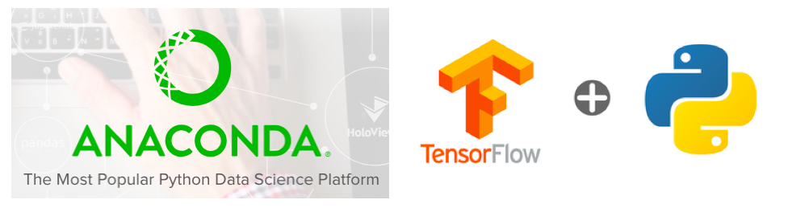

# Data_Science_Python



Python is a great general-purpose programming language on its own, but with the help of a few popular libraries (numpy, scipy, matplotlib, tensorflow, pytorch) it becomes a powerful environment for scientific computing and data analysis.

I started the notebook repo as a beginner tutorial in 2018, then I updated it with more and more interesting topics around the python programming and applications.

## Introduction to Python

Python is a high-level, dynamically typed multi-paradigm programming language. Python code is often said to be almost like pseudocode, since it allows you to express very powerful ideas in very few lines of code while being very readable.
Here is the formal web of Python: [https://www.python.org], you can find a lot of useful learning materials here.

## Project Structure

The repository is organized into semantic directories to separate learning materials from source code and infrastructure:

### `notebooks/`

Domain-specific Jupyter Notebooks for interactive learning:

- **`01_basics/`**: Python fundamentals and core libraries (NumPy, Pandas).
- **`02_math_stats/`**: Probability and statistical analysis.
- **`03_deep_learning/`**: Comprehensive guides for **TensorFlow** (TF1.x, TF2.x, Keras) and **PyTorch**.
- **`04_nlp/`**: Natural Language Processing, including Word Embeddings and Transformers.
- **`05_cv/`**: Computer Vision and segmentation metrics.
- **`06_tabular_ml/`**: Scikit-Learn, SHAP, and AutoML (AutoGluon).
- **`07_big_data/`**: PySpark and distributed computing examples.

### `src/`

Refactored Python source code and application modules:

- **`algorithms/`**: Implementation of classic algorithms and data structures.
- **`geospatial/`**: Tools for GIS and Geospatial data analysis.
- **`visualization/`**: Advanced plotting (Bokeh, Dash, Folium).
- **`web/`**: Web service implementations using FastAPI and Tornado.
- **`gui/`**: Desktop GUI development with PySimpleGUI.

### `assets/` & `scripts/`

- **`assets/`**: Centralized images, diagrams, and GIFs used across the project.
- **`scripts/`**: Development infrastructure, including linter configurations for `black` and `flake8`.

## Development Standards

This project uses **pre-commit** hooks to maintain high code quality:

- **`nb-clean`**: Automatically clears notebook metadata and outputs to keep the repo slim.
- **`black`**: Enforces a consistent code style.
- **`flake8`**: Checks for PEP8 compliance and programming errors.

## Python Versions

Check this [https://devguide.python.org/versions/](https://devguide.python.org/versions/) for your new project to choose the right python version.

As of 2026, I recommend using **Python 3.12+** for new projects to take advantage of significant performance improvements and modern syntax features. This repository is periodically refreshed to ensure compatibility with recent stable releases.

## Install Conda

### Anaconda

The open source Anaconda Distribution is the easiest way to do Python data science and machine learning. It includes hundreds of popular packages and a powerful virtual environment manager.

- [Download Anaconda](https://www.anaconda.com/download/)

### Miniconda (Recommended)

If you prefer a lightweight installation, **Miniconda** is recommended. It includes only conda, Python, and their dependencies, allowing you to install only what you need.

- [Download Miniconda](https://docs.conda.io/en/latest/miniconda.html)

## Basic conda commands

One good feature about `conda` is its virtual environment manager, it avoids the confusion of different version python interpreters mess your computer default or previous projects.

```bash
# Create a new environment
conda create --name ds_python python=3.12

# Activate environment
conda activate ds_python

# Install core packages
conda install numpy pandas matplotlib scikit-learn
```

## License

This **Data_Science_Python** is distributed under the [MIT LICENCE](MIT License.txt).
